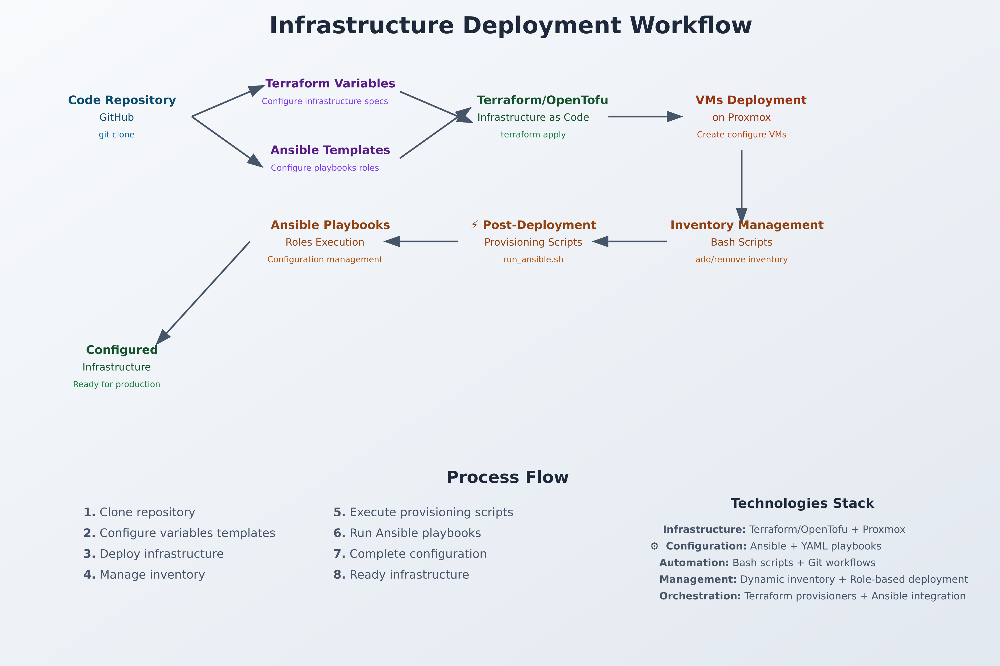

# Proxmox VM Automation :  

This project automates the deployment and configuration of VMs on Proxmox server using Terraform and Ansible  

## Requirements

 **Terraform/OpenTofu** installed  
 **Ansible**  installed  
 **Proxmox** with:  
   - Dedicated Proxmox user with appropriate permissions (using API token if possible)
   - VM template ready for use (with cloud-init if you need it)


## Architecture explanation 
This automation project using terraform with vm module to deploy one or more VM on Proxmox server, and configure VMs with ansible role


## Project structure
```
Proxmox-automation
.
├── 01-Infra
    ├── main.tf
    ├── modules
    ├── outputs.tf
    ├── providers.tf
    ├── README.md
    ├── scripts
    └── variables.tf
└── 02-config
│   ├── ansible.cfg
│   ├── dns-config.yaml
│   ├── inventory.ini
│   ├── main.yaml
│   ├── roles
│   ├── sshd-config.yaml
│   └── users.yaml
└── 03-Additional-scripts
│   ├── VM-power-management
│   ├── ....

```
There are 2 main directories in this projet :  
```
01-Infra -> Terraform directory to create VM
- Cloud-init can be used to customize user/network/ssh key
- Bash script to automatically add/remove the deployed/destroyed VM in the inventory.ini (ansible)
- Bash script for automatically execute playbook associate to deployed VMs

02-Config -> ansible directory with roles for :
- create /manage users
- hardening / config ssh
- Config DNS/ host file
- add packages

03-Additional-scripts -> other resources for proxmox automation 
```
## 📋 Workflow Steps

### 1. 📁 **Source Code Management**
```bash
git clone https://github.com/cer3br0/proxmox-automation.git
cd proxmox-automation
```
### 2. ⚙️ **Configuration Phase**
## Configuration

### Proxmox
Ensure you have : 
```
- Template(s) ready for deployment
- Dedicated user for terraform with API Token
```

To Create dedicated user in proxmox with good permissions :
```bash
# On Proxmox
pveum user add terraform-user@pve
pveum passwd terraform-user@pve
pveum role add TerraformProv -privs "VM.Allocate VM.Clone VM.Config.CDROM VM.Config.CPU VM.Config.Cloudinit VM.Config.Disk VM.Config.HWType VM.Config.Memory VM.Config.Network VM.Config.Options VM.Monitor VM.Audit VM.PowerMgmt Datastore.AllocateSpace Datastore.Audit"
pveum aclmod / -user terraform-user@pve -role TerraformProv # this one is not necessary if you use token
pveum user token add terraform-user@pve terraform-token --comment "Token for Terraform usage" --enable 1
pveum aclmod / -token terraform-user@pve!terraform-token -role TerraformProv
```  
Ensure you save the token value in secret manager.  

### 🎭 Ansible Templates & Variables Setup  
- Configure inventory templates
- Set up vars in each role -> default/main.yml or vars/main.yml
- Add another role if you need it
- Prepare role-specific configurations

### 📝 Terraform Variables Configuration
- Configure `terraform.tfvars` or `*.auto.tfvars`
- Define VM specifications, network settings, and resources
- Set Ansible roles per VM using roles names -> ansible_roles = ["sshd", "dns-host", "users"]

### 3. 🏗️ **Infrastructure Deployment**  
Navigate to 01-Infra directory :  
```bash
tofu init #or terraform init
tofu plan #or terraform plan
tofu apply  #or terraform apply
```
- Creates VMs on Proxmox
- Provisions resources (CPU, RAM, Storage, Network)
- Applies cloud-init configurations  

### Terraform triggers are used to add/remove lines in the file ./02-Config/inventory.ini and execute playbook via bash scripting ./01-Infra/scripts using a "null_resource" and provisionner local-exec.  

### 4. 📋 **Dynamic Inventory Management**
- `add_to_inventory.sh` - Adds new VMs to Ansible inventory
- `remove_from_inventory.sh` - Removes destroyed VMs from inventory

## 5. ⚡ **Post-Deployment Provisioning**
```bash
run_ansible.sh <vm_name> <vm_ip> <template> <roles...>
```
This script is automatically execute by terraform local-exec provisioner and :  
```
- Execute target Ansible playbooks -> ./02-Config/main.yaml
- Apply specified roles for each VM
```
# Terraform use  
## For information and configuration of Terraform, please look at the README.md in directory **./01-Infra**

# Ansible integration 

For user compatibility and automation, ensure :  
```
- You have an ansible dedicated user with ssh public key include in all your VMs templates
- You use terraform and cloud init to create an ansible dedicated user with ssh key when deploying
```

## For ansible information and configuration, please look at the README.md in each roles directory **./02-Config/roles/**

# Common mistakes

## Provider Proxmox
```bash
# If tls certificate error
proxmox_tls_insecure = true -> false
```

## Bad template
List and find your templates :
```bash
# Proxmox CLI
qm list | awk '{print$2}'
```

## Permissions denied for user/API token when apply 
Verify your token as the correct permissions for create and manage VM :
```
VM.Allocate VM.Clone VM.Config.CDROM VM.Config.CPU VM.Config.Cloudinit VM.Config.Disk VM.Config.HWType VM.Config.Memory VM.Config.Network VM.Config.Options VM.Monitor VM.Audit VM.PowerMgmt Datastore.AllocateSpace Datastore.Audit
```

# Best practices

## Safety
1. **Never commit** `terraform.tfvars` or sensitive information in git
2. Use **SSH keys** instead of passwords
3. Create a **dedicated** Proxmox user for Terraform with API key
4. Use **valid certificates** if possible
5. Use Ansible vault for secrets 

## Organization
1. **Tag** VMs for easier management
2. Use **descriptive** and consistent names
3. **Document** each VM's configuration and Ansible roles
4. Make **backups** before major modifications

## Performance
1. Use the **appropriate disk type** (virtio for performance)
2. Enable **QEMU agent** for better information
3. Configure **resources** according to actual usage

## Future developments

This module can be extended to support :
- Multiple **disks** per VM
- Multiple network interfaces
- Automatic snapshots
- Add another roles for specific configuration (database, webserver, docker...)


# Troubleshooting

## VM won't start
1. Check Proxmox logs
2. Check resources available on node
3. Check template configuration

## Network problems
1. Check bridge configuration
2. Check VLANs if used
3. Check cloud-init if static IP
