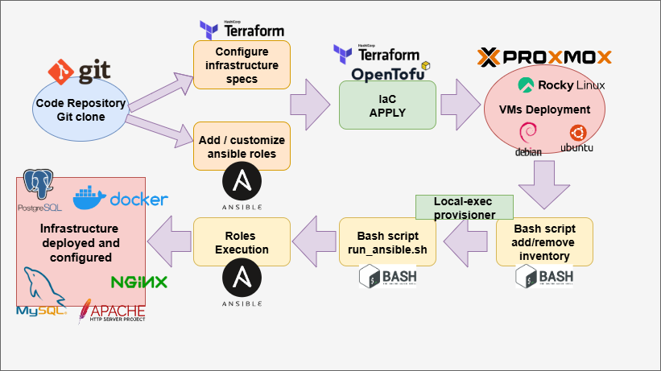

# Proxmox VM Automation :  

This project automates the deployment and configuration of VMs on Proxmox server using Terraform and Ansible  

## Requirements

 **Terraform/OpenTofu** installed  
 **Ansible**  installed  
 **Proxmox** with:  
   - Dedicated user with appropriate permissions (using API token if possible)
   - VM template ready for use (with cloud-init if you need it)

## Architecture explanation 
This project using terraform with vm module to deploy one or more VM on Proxmox server, and configure VM including roles for 


There are 2 main directories in this projet :  
```
01-Infra -> Terraform directory to create VM
- Cloud-init can be used to customize user/network/ssh key
- Bash script to automatically add/remove the deployed/destroyed VM in the inventory.ini (ansible)

02-Config -> ansible directory with roles for :
- create /manage users
- hardening / config ssh
- Config DNS/ host file
- add packages

03-Additional-scripts -> other resources for proxmox automation :
```

```
Proxmox-automation
.
├── 01-Infra
    ├── main.tf
    ├── modules
    ├── outputs.tf
    ├── providers.tf
    ├── README.md
    ├── scripts
    └── variables.tf
└── 02-config
│   ├── ansible.cfg
│   ├── dns-config.yaml
│   ├── inventory.ini
│   ├── main.yaml
│   ├── roles
│   ├── sshd-config.yaml
│   └── users.yaml
└── 03-Additional-scritps
│   ├── VM-power-management
│   ├── ....

```

## Configuration

### Configuration Proxmox

Create dedicated user in proxmox with good permissions :
```bash
# On Proxmox
pveum user add terraform-user@pve
pveum passwd terraform-user@pve
pveum role add TerraformProv -privs "VM.Allocate VM.Clone VM.Config.CDROM VM.Config.CPU VM.Config.Cloudinit VM.Config.Disk VM.Config.HWType VM.Config.Memory VM.Config.Network VM.Config.Options VM.Monitor VM.Audit VM.PowerMgmt Datastore.AllocateSpace Datastore.Audit"
pveum aclmod / -user terraform-user@pve -role TerraformProv
```

# Terraform use

## For information and configuration, please look at the README.md in directory **./01-Infra**

# Ansible integration 

For user compatibility and automation, ensure :  
```
- You have an ansible dedicated user with ssh public key include in all your VMs templates
- You use terraform and cloud init to create an ansible dedicated user with ssh key when deploying
```

Terraform output are used to add/remove lines in the file ./02-Config/inventory.ini via bash scripting ./01-Infra/scripts using a "null_resource" and provisionner local-exec for script executing  

## For ansible information and configuration, please look at the README.md in each roles directory **./02-Config/roles/**

# 📋 Workflow Steps

## 1. 📁 **Source Code Management**
```bash
git clone <repository-url>
cd infrastructure-project
```

## 2. ⚙️ **Configuration Phase**

### 📝 Terraform Variables Configuration
- Configure `terraform.tfvars` or `*.auto.tfvars`
- Define VM specifications, network settings, and resources
- Set Ansible roles per VM

### 🎭 Ansible Templates & Variables Setup  
- Configure inventory templates
- Set up group_vars and host_vars
- Prepare role-specific configurations
- Define playbook variables

## 3. 🏗️ **Infrastructure Deployment**
```bash
terraform init
terraform plan
terraform apply
```
- Creates VMs on Proxmox
- Provisions resources (CPU, RAM, Storage, Network)
- Applies cloud-init configurations

## 4. 📋 **Dynamic Inventory Management**
- `add_to_inventory.sh` - Adds new VMs to Ansible inventory
- `remove_from_inventory.sh` - Removes destroyed VMs from inventory
- Updates inventory groups and host variables

## 5. ⚡ **Post-Deployment Provisioning**
```bash
run_ansible.sh <vm_name> <vm_ip> <template> <roles...>
```
- Executes targeted Ansible playbooks
- Applies specified roles to each VM
- Configures services and applications

# Common mistakes

## Provider Proxmox
```bash
# If tls certificate error
proxmox_tls_insecure = true -> false
```

## bad template
List and find your template :
```bash
# Proxmox CLI
qm list 
```

## Permissions denied for user/API token
Verify your token as the correct permissions for create and manage VM :
```
VM.Allocate VM.Clone VM.Config.CDROM VM.Config.CPU VM.Config.Cloudinit VM.Config.Disk VM.Config.HWType VM.Config.Memory VM.Config.Network VM.Config.Options VM.Monitor VM.Audit VM.PowerMgmt Datastore.AllocateSpace Datastore.Audit
```

# Best practices

## Safety
1. **Never commit** `terraform.tfvars` or sensitive information in git
2. Use **SSH keys** instead of passwords
3. Create a **dedicated** Proxmox user for Terraform
4. Use **valid certificates** if possible

## Organization
1. **Tag** VMs for easier management
2. Use **descriptive** and consistent names
3. **Document** each VM's configuration
4. Make **backups** before major modifications

## Performance
1. Use the **appropriate disk type** (virtio for performance)
2. Enable **QEMU agent** for better information
3. Configure **resources** according to actual usage

## Future developments

This module can be extended to support :
- Multiple **disks** per VM
- Multiple network interfaces
- Automatic snapshots
- Add another roles specific configuration (database, webserver,...)


# Troubleshooting

## VM won't start
1. Check Proxmox logs
2. Check resources available on node
3. Check template configuration

## Network problems
1. Check bridge configuration
2. Check VLANs if used
3. Check cloud-init if static IP
